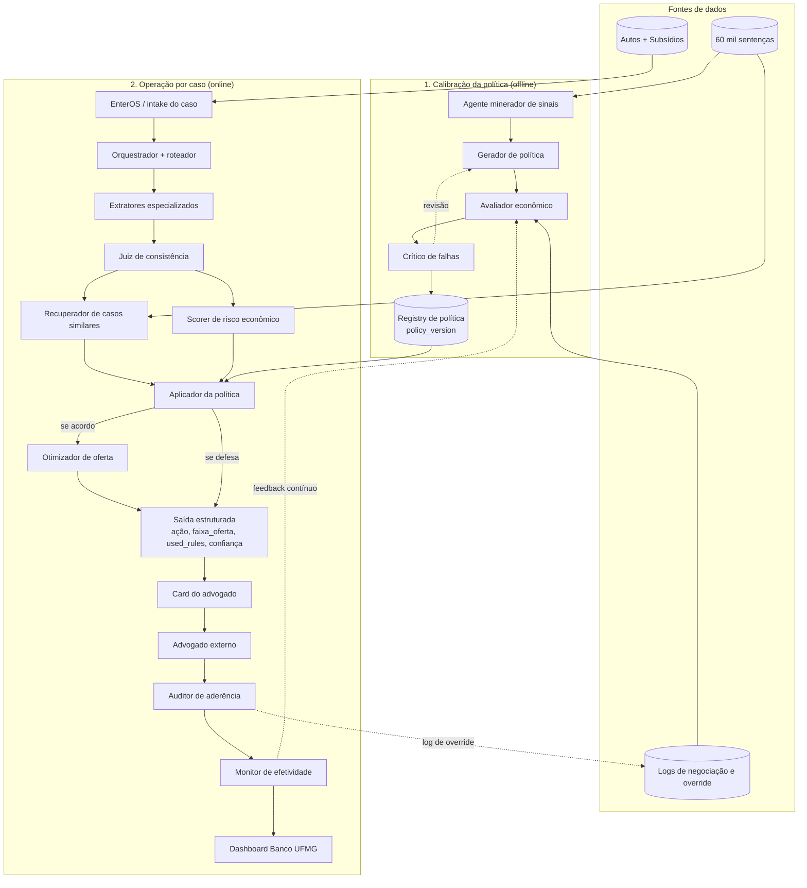
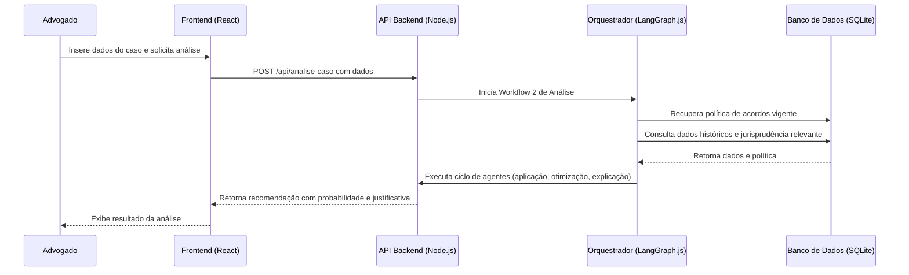

# Documento de Arquitetura — HACKATON

## 1. Visão Geral da Solução

O sistema HACKATON visa resolver uma dor central no setor jurídico: a dificuldade em tomar decisões ótimas e baseadas em dados sobre a condução de processos legais, especificamente a escolha entre celebrar um acordo ou prosseguir com o litígio. Atualmente, essa decisão é impactada pela falta de uma política clara, dados insuficientes para análises complexas e a incapacidade de prever com precisão os múltiplos desfechos de um processo (extinção, improcedência, procedência, etc.).

Os principais **stakeholders** são:
- **Advogados:** Utilizarão o sistema como um "copiloto" para analisar casos individuais, receber recomendações e justificativas, auxiliando em sua decisão estratégica.
- **Analistas de Políticas / Administradores do Sistema:** Responsáveis por monitorar o desempenho das políticas de acordo, configurar o sistema para diferentes tipos de processos e supervisionar a otimização contínua das regras de decisão.

O **objetivo da solução arquitetural** é criar um sistema de apoio à decisão baseado em Inteligência Artificial, utilizando uma arquitetura multiagente. Tecnicamente, a solução irá:
1.  **Gerar e Otimizar Políticas de Acordo:** Através de um workflow assíncrono (semanal), o sistema analisará dados históricos para criar e refinar uma política de acordos em formato de árvore de decisão.
2.  **Fornecer Recomendações em Tempo Real:** Através de um workflow síncrono, o sistema analisará dados de um caso específico submetido pelo advogado, aplicará a política vigente e gerará uma recomendação clara (acordo ou processo) com probabilidades e justificativas.
3.  **Visualizar Dados:** Apresentar um dashboard para que os administradores possam acompanhar a performance e o impacto das políticas aplicadas.

O sistema se encaixa no ecossistema do cliente como uma ferramenta consultiva e de inteligência, potencializando o conhecimento do advogado com análises de dados em larga escala, visando a padronização, otimização e a melhoria dos resultados financeiros e jurídicos.

## 2. Diagrama de Arquitetura

O diagrama a seguir ilustra os principais componentes do sistema, inferidos a partir das decisões arquiteturais. A arquitetura é dividida em Frontend, Backend (com seus dois workflows principais) e a camada de persistência de dados.

## 3. Diagrama de Integrações

Este diagrama de sequência ilustra o fluxo de uma análise de caso sob demanda, iniciada por um advogado (Workflow 2), mostrando a interação entre a interface, os serviços de backend e o banco de dados.

## 4. Stack Tecnológica

A stack tecnológica foi definida com base nas Decisões Arquiteturais (ADRs) registradas. Nenhum módulo foi retornado pela ferramenta `getSelectedTechnologyModules`, portanto, a tabela abaixo foi construída a partir das informações contidas nos ADRs.

| Tecnologia / Módulo | Categoria | Responsabilidade no Sistema | Justificativa |
|---|---|---|---|
| React (com Vite) | Frontend | Construção da interface do usuário, incluindo o "Copiloto do Advogado" e o Dashboard de métricas. | Alavanca a expertise do time em JavaScript, oferece um ambiente de desenvolvimento rápido e performático, ideal para interfaces ricas e componentizadas. (ADR-6089c7e7) |
| Node.js | Backend | Servir a API que se comunica com o frontend e orquestrar os workflows de IA. | Mantém a consistência da stack (JavaScript/TypeScript) e é a plataforma base para a execução do LangGraph.js, aproveitando a expertise do time. (ADR-8bffb604, ADR-2e9897a6) |
| LangGraph.js | Orquestração de IA | Orquestrar os agentes e os fluxos de trabalho complexos, tanto para a geração de política (Workflow 1) quanto para a análise de casos (Workflow 2). | Ideal para aplicações multiagente e estatais, permitindo controle de fluxo avançado e modelagem explícita de grafos, sendo superior a alternativas para a complexidade exigida. (ADR-8bffb604) |
| Arquitetura Multiagente | Padrão Arquitetural | Estrutura fundamental do sistema, onde agentes especializados colaboram para resolver problemas complexos como otimização de políticas e análise de casos. | Oferece modularidade, flexibilidade e escalabilidade, essenciais para os requisitos de otimização contínua, adaptação e captura de feedback. (ADR-401b1d3a, ADR-ad75dcbd) |
| SQLite | Banco de Dados | Armazenar dados estruturados dos processos legais, histórico, jurisprudência e as políticas de acordo geradas. | Solução robusta e madura para o volume de dados do projeto (~60.000 processos), permitindo consultas complexas e garantindo a integridade dos dados para as análises. (ADR-21abae2b) |
| Modelo Actor-Critic | Algoritmo de IA/ML | Utilizado no Workflow 1 para o ciclo de feedback e otimização contínua da política de acordos, melhorando-a iterativamente. | Garante a melhoria iterativa da política, adaptando-a a novos padrões e maximizando o potencial de economia financeira ao longo do tempo. (ADR-2e9897a6) |

## 5. Mapeamento de Requisitos para Componentes

| Código RF | Requisito Funcional | Componente / Módulo Responsável | User Stories Relacionadas |
|---|---|---|---|
| RF-01 | Análise de Casos Legais | Frontend, Backend (Workflow 2) | US-07, US-08 |
| RF-02 | Recomendação de Acordo ou Processo | Backend (Workflow 2) | US-09, US-10 |
| RF-03 | Previsão de Resultados Processuais | Backend (Workflow 2) | US-01, US-02 |
| RF-04 | Geração de Proposta de Acordo | Backend (Workflow 2) | US-03, US-04 |
| RF-05 | Otimização da Política de Acordos | Backend (Workflow 1) | US-05, US-06 |
| RF-07 | Visualização de Dados e Resultados | Frontend (Dashboard) | US-11, US-12 |
| RF-08 | Adaptação a Diferentes Processos | Backend (Workflow 1), Banco de Dados | US-13, US-14 |
| RF-09 | Análise de Jurisprudência Histórica | Backend (Workflows 1 e 2), Banco de Dados | US-16 |
| RF-10 | Captura de Feedback do Usuário | Frontend, Banco de Dados | US-17, US-18 |
| RF-11 | Simulação de Políticas Dinâmicas | Backend (Workflow 1) | US-19, US-20 |
| RF-12 | Justificativa da Recomendação | Backend (Workflow 2) | US-21, US-22 |

## 6. Decisões Arquiteturais

### ADR-401b1d3a: Adoção de Arquitetura Multiagente

**Status:** ACCEPTED

**Decisão:** O sistema será construído utilizando uma arquitetura multiagente para gerenciar a complexidade das decisões legais e otimizar a política de acordos.

**Justificativa:** A arquitetura multiagente oferece modularidade, flexibilidade e escalabilidade, permitindo a resolução de problemas complexos através da colaboração de agentes especializados. Isso se alinha com os requisitos de otimização contínua (RF-05, RF-06), adaptação a diferentes processos (RF-08) e incorporação de feedback (RF-10).

**Alternativas Rejeitadas:** N/A

---
### ADR-21abae2b: Uso de SQLite para Base de Dados Local

**Status:** ACCEPTED

**Decisão:** O sistema utilizará SQLite como banco de dados principal para armazenar todos os dados estruturados dos processos legais, incluindo histórico, valores, resultados e políticas geradas.

**Justificativa:** O SQLite é uma solução robusta e madura para ambientes locais, ideal para gerenciar os 60.000 processos existentes com sua estrutura de dados bem definida. Permite consultas complexas e garante a integridade dos dados, essenciais para a análise de jurisprudência (RF-09) e otimização de políticas (RF-05).

**Alternativas Rejeitadas:** N/A

---
### ADR-8bffb604: Uso de LangGraph.js para Orquestração Multiagente

**Status:** ACCEPTED

**Decisão:** O sistema utilizará LangGraph.js para a orquestração dos agentes e a implementação dos workflows de IA, aproveitando sua capacidade de modelar interações complexas entre múltiplos atores.

**Justificativa:** LangGraph.js é projetado especificamente para aplicações estatais e multiator, permitindo um controle de fluxo avançado, gerenciamento de estado e modelagem explícita de grafos. Isso é ideal para os dois workflows multiagentes do projeto (geração de política e decisão acordo/processo), garantindo uma orquestração robusta e escalável. A escolha se alinha com a expertise do time em Node.js.

**Alternativas Rejeitadas:** LangChain.js: Rejeitado por ser menos adequado para a orquestração complexa e o controle de fluxo avançado exigidos por uma arquitetura multiagente com múltiplos workflows e estados.

---
### ADR-6089c7e7: Uso de React com Vite para o Frontend

**Status:** ACCEPTED

**Decisão:** O frontend do sistema, incluindo o copiloto para advogados e o dashboard, será desenvolvido utilizando React com Vite.

**Justificativa:** A escolha de React com Vite alavanca a expertise do time em JavaScript/Node.js, proporcionando um ambiente de desenvolvimento rápido e eficiente. React permite a construção de interfaces de usuário complexas e componentizadas, enquanto Vite oferece um build tool moderno e performático, ideal para o desenvolvimento ágil do copiloto (RF-01, RF-02, RF-12) e do dashboard (RF-07).

**Alternativas Rejeitadas:** Outros frameworks JavaScript (Vue, Angular) ou abordagens de frontend (SSR com frameworks Node.js). Rejeitados para manter a simplicidade e focar na expertise do time e nos benefícios de performance e desenvolvimento rápido de React/Vite.

---
### ADR-2e9897a6: Workflow 1: Geração e Otimização da Política de Acordos (Execução Semanal)

**Status:** ACCEPTED

**Decisão:** Adotaremos uma arquitetura multiagente para o Workflow 1, orquestrada por LangGraph.js (Node.js), implementando um ciclo de feedback Actor-Critic. A geração da política será baseada em uma abordagem híbrida ML/LLM, onde os agentes LLM interagem com tools especializadas para acessar dados e executar análises estatísticas no SQLite. Os dados históricos serão divididos em 70% para treinamento (geração da política) e 30% para simulação (teste/validação) para garantir a robustez e evitar overfitting. A política final será persistida no SQLite como um "prompt em texto natural".

**Justificativa:** O Workflow 1 é o componente responsável pela criação e otimização contínua da Política de Acordos. A abordagem híbrida ML/LLM com tools dedicadas mitiga alucinações de LLMs e garante que as decisões sejam baseadas em dados factuais. A separação 70/30 dos dados e o loop Actor-Critic garantem que a política gerada seja validada e mais confiável.

**Alternativas Rejeitadas:** N/A

---
### ADR-ad75dcbd: Workflow 2: Análise de Casos e Recomendação com Arquitetura Multiagente

**Status:** ACCEPTED

**Decisão:** Adotar uma arquitetura multiagente para o Workflow 2, com agentes especializados para pré-processamento, recuperação de dados, cálculo de métricas, aplicação de política, otimização de oferta, explicação, auditoria e monitoramento.

**Justificativa:** Esta arquitetura modular e distribuída permite gerenciar a complexidade do processo de análise e recomendação de casos legais, garantindo a rastreabilidade das decisões, a incorporação de dados históricos e a geração de justificativas claras para os advogados, atendendo a múltiplos requisitos funcionais e user stories.

**Alternativas Rejeitadas:** N/A

---

## 7. Segurança, Escalabilidade e Manutenibilidade

**Segurança:**
- **Autenticação e Autorização:** Os dados não especificam uma estratégia de autenticação. Recomenda-se a implementação de um fluxo padrão baseado em tokens (ex: JWT) para a API, garantindo que apenas usuários autenticados (advogados, administradores) possam acessar os recursos. Níveis de autorização devem ser aplicados para distinguir as ações permitidas para cada papel (ex: administrador pode configurar políticas, advogado pode apenas consultar).
- **Proteção de Dados e Privacidade:** Os dados de processos legais são sensíveis. O banco de dados SQLite, por ser um arquivo local, deve ter suas permissões de acesso rigorosamente controladas no ambiente de servidor. Em uma evolução do projeto para um ambiente de produção mais robusto, a criptografia do banco de dados (at rest) deve ser considerada. Comunicação entre cliente e servidor deve ocorrer exclusivamente via HTTPS.
- **Vulnerabilidades da Stack:** Utilizar versões atualizadas de Node.js, React e suas dependências é crucial. Ferramentas como `npm audit` devem ser integradas ao pipeline de CI/CD para identificar e mitigar vulnerabilidades conhecidas.

**Escalabilidade:**
- **Pontos de Escala:** O backend em Node.js é stateless e pode ser escalado horizontalmente com a adição de mais instâncias por trás de um load balancer. O Workflow 1 (geração de política) é um processo em lote (batch) e não impacta a escalabilidade da aplicação em tempo real. O Workflow 2 (análise de caso) é o principal alvo de escala.
- **Gargalos Potenciais:** O uso de SQLite como banco de dados central pode se tornar um gargalo de performance, pois não é projetado para alta concorrência de escrita/leitura. Para um grande número de usuários simultâneos, a migração para um sistema de banco de dados cliente-servidor (como PostgreSQL ou MySQL) seria necessária.
- **Estratégias Recomendadas:** Para o curto prazo, a arquitetura é adequada. Para o longo prazo, planejar a migração do SQLite para um banco de dados mais robusto e considerar o uso de filas de mensagens (ex: RabbitMQ) se os tempos de processamento do Workflow 2 se tornarem muito longos, transformando-o em uma operação parcialmente assíncrona.

**Manutenibilidade:**
- **Separação de Responsabilidades:** A arquitetura multiagente é o ponto forte da manutenibilidade. Cada agente tem uma responsabilidade única e bem definida (ex: agente de explicação, agente de análise de dados), o que facilita a manutenção, o teste e a evolução de cada componente de forma isolada. A separação clara entre Frontend, Backend e Dados também segue as melhores práticas.
- **Estratégia de Versionamento e Deployment:** Recomenda-se o uso de Git para controle de versão. Um pipeline de CI/CD (ex: GitHub Actions, Jenkins) deve ser implementado para automatizar testes, builds e deployments, garantindo consistência e agilidade.
- **Observabilidade:** Configurar um sistema de logging estruturado no backend Node.js é fundamental para rastrear o fluxo de requisições e a execução dos workflows. Ferramentas de monitoramento de performance de aplicação (APM) podem ser integradas para observar o tempo de resposta da API e o consumo de recursos.

## 8. Glossário Técnico

| Termo | Definição |
|---|---|
| Arquitetura Multiagente | Um sistema composto por múltiplos agentes computacionais autônomos que interagem entre si para atingir objetivos. Ideal para resolver problemas complexos e distribuídos. |
| LangGraph.js | Uma biblioteca para construir aplicações de IA robustas e estatais, orquestrando múltiplos agentes ou cadeias de LLMs em um formato de grafo. |
| Actor-Critic | Uma classe de algoritmos de aprendizado por reforço que utiliza dois modelos: o "Actor" para decidir uma ação (a política) e o "Critic" para avaliar essa ação. |
| LLM (Large Language Model) | Um modelo de linguagem de grande escala treinado em vastas quantidades de texto, capaz de gerar e compreender linguagem natural. |
| Copiloto (IA) | Uma ferramenta de assistência baseada em IA que auxilia um usuário a realizar tarefas complexas em tempo real, fornecendo sugestões e análises. |
| SQLite | Um motor de banco de dados relacional autocontido, sem servidor, que armazena dados em um único arquivo no disco local. |
| Workflow | Uma sequência de passos ou tarefas orquestradas para processar dados e alcançar um resultado específico. No projeto, há o workflow de geração de política e o de análise de caso. |

---

_Status: **DRAFT** | Última atualização: 17/04/2026_
