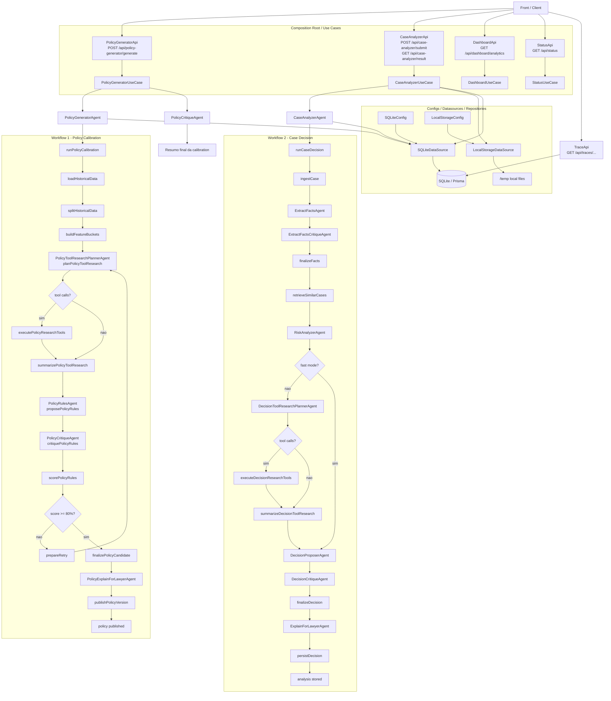

# Architecture Flow

A integração atual do `new/backend` está organizada a partir do composition root em `index.ts`, das rotas em `transportlayers/api/registerBackendApis.ts` e dos grafos em `graphs/policy-calibration-graph.ts` e `graphs/case-decision-graph.ts`.

## Mermaid

## Descrição Dos Agentes

- `PolicyGeneratorAgent`: dispara o `workflow1` completo e delega a calibração da policy ao grafo offline.
- `PolicyRulesAgent`: gera as regras candidatas da policy a partir dos buckets históricos e do contexto de tools.
- `PolicyCritiqueAgent`: critica as regras da policy e também resume o resultado final da calibração.
- `PolicyToolResearchPlannerAgent`: decide quais tools de banco consultar antes de propor ou criticar a policy.
- `PolicyExplainForLawyerAgent`: transforma a policy final em linguagem natural para consumo do advogado.
- `CaseAnalyzerAgent`: carrega a policy ativa, valida o caso e dispara o `workflow2`.
- `ExtractFactsAgent`: extrai fatos estruturados dos documentos do caso.
- `ExtractFactsCritiqueAgent`: revisa os fatos extraídos, aponta inconsistências e reforça governança.
- `RiskAnalyzerAgent`: calcula o risco combinando histórico similar com prior documental, evitando o fallback cego de `50%`.
- `DecisionToolResearchPlannerAgent`: decide se vale consultar tools antes de propor a decisão do caso.
- `DecisionProposerAgent`: propõe a decisão inicial com base em policy, fatos, risco e tools.
- `DecisionCritiqueAgent`: critica a decisão proposta antes da finalização.
- `ExplainForLawyerAgent`: gera a explicação final em linguagem natural para o advogado.

## Descrição Das Camadas Conectadas

- `PolicyGeneratorApi`: porta HTTP do `workflow1`.
- `CaseAnalyzerApi`: porta HTTP do `workflow2`, inclusive com `GET` do resultado final.
- `DashboardApi`: consolida métricas para o front.
- `StatusApi`: consulta o estado do caso.
- `TraceApi`: expõe os traces JSON e HTML dos workflows.
- `PolicyGeneratorUseCase`: orquestra geração e crítica ou resumo da policy.
- `CaseAnalyzerUseCase`: cria ou reutiliza caso, salva documentos, chama análise e expõe o resultado.
- `SQLiteDataSource`: ponte entre use cases ou agentes e o banco SQLite com Prisma.
- `LocalStorageDataSource`: salva os arquivos temporários enviados no fluxo do caso.
